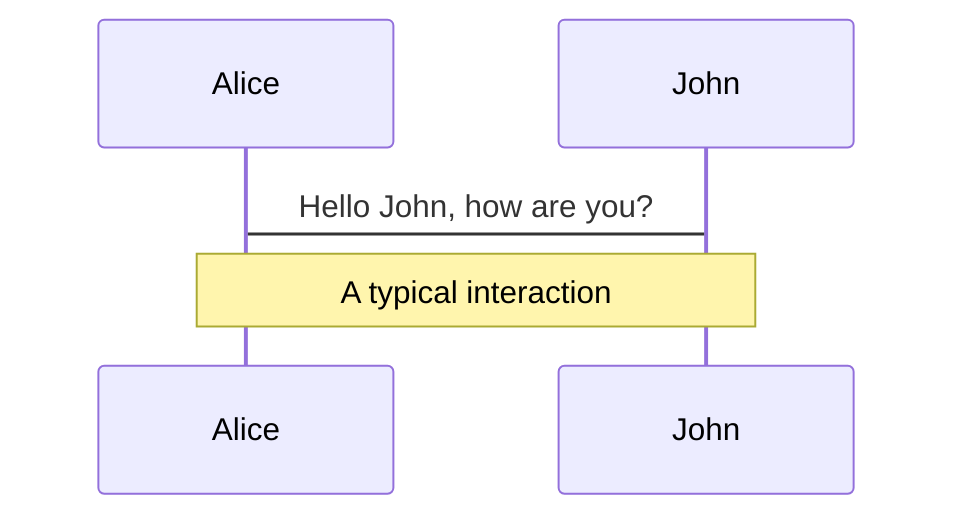
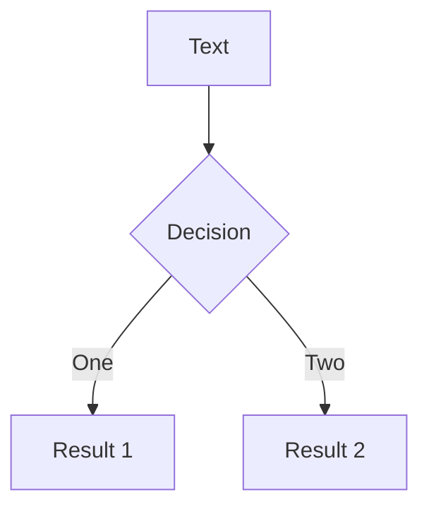
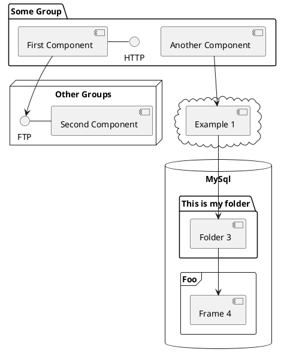

# アプリケーションエンジニアから見た<br>PostgreSQL15 の新機能

2022-10-01 OSC 2022 オンライン広島 <br>
日本 PostgreSQL ユーザー会 中国支部長 高橋 一騎

---

# 注意事項

- スライドは公開しています。
- 質問は **#osc22hi** に投稿してもらえれば、後ほど拾う事もできるかと思いますので是非活用してください。

---

# おしながき

- 自己紹介
- PostgreSQLとは
- PostgreSQL15の新機能
- まとめ

---

# 自己紹介

<div class="grid grid-cols-2 gap-4">

<div>
  <ul>
    <li>高橋 一騎 (<a href="https://twitter.com/ikkitang">@ikkitang</a>)</li>
    <li>岡山在住</li>
    <li>スターフェスティバル株式会社<br>TechPdM 兼 アプリケーションエンジニア</li>
    <li>日本PostgreSQLユーザー会 中国地方支部長</li>
  </ul>
</div>

<div class="">
  
</div>

</div>

---

# 自己紹介

- 日本PostgreSQLユーザー会中国地方支部長ではありますが、普段は普通にWebアプリケーションのコードを書いてていわゆるDBA的な仕事はしていません。
  - 割とPostgreSQLやMySQLはAWSのAmazon RDSでシュッと導入して使っています。
- 本セッションでは、今回のPostgreSQL15に入る機能をアプリケーションエンジニアとしての立場からピックアップをした上でご紹介をさせていただければと思います。

---
layout: center
class: text-center
---

# 2. PostgreSQLとは

---

# 2. PostgreSQLとは

<div class="grid grid-cols-2 gap-4">

<div>
<ul>
  <li>代表的なオープンソースのRDBMSの一つ</li>
  <li>もともと、大学の研究用に開発された研究用のRDBMSの <code>ingress</code> が元となっている。</li>
  <li>PostgreSQL開発コミュニティによって開発が行われていて、約1年弱の開発期間を経た後、毎年9~10月頃にメジャーバージョンがリリースされている。</li>
  <li>今年は<code>PostgreSQL15</code>のリリースに向けて開発が行われており、2022-10-06にGAの予定が発表された</li>
</ul>
</div>

<div>
  <Tweet id="1571857779643777024" />
</div>

</div>

---

# PostgreSQLの特徴

<div class="grid grid-cols-2 gap-10">
  <div>
    <h2>複数のIndexアルゴリズムを<br>サポート</h2>
    <ul>
      <li>B-Tree Index</li>
      <li>Hash Index</li>
      <li>GiST Index, SP-GiST index, GIN Index</li>
      <li>BRIN Index</li>
    </ul>
  </div>
  
  <div>
    <h2>豊富なデータ型をサポート</h2>
    <ul>
      <li>数値型, 文字型, boolean型, 列挙型</li>
      <li>UUID型</li>
      <li>JSON型</li>
      <li>配列型</li>
      <li>範囲型</li>
      <li>
        幾何データ型
        <ul>
          <li>座標点</li>
          <li>直線</li>
          <li>円</li>
        </ul>
      </li>
      <li>IPアドレス型</li>
    </ul>
  </div>
</div>

---

# Navigation

Hover on the bottom-left corner to see the navigation's controls panel, [learn more](https://sli.dev/guide/navigation.html)

### Keyboard Shortcuts

|                                                    |                             |
| -------------------------------------------------- | --------------------------- |
| <kbd>right</kbd> / <kbd>space</kbd>                | next animation or slide     |
| <kbd>left</kbd> / <kbd>shift</kbd><kbd>space</kbd> | previous animation or slide |
| <kbd>up</kbd>                                      | previous slide              |
| <kbd>down</kbd>                                    | next slide                  |

<!-- https://sli.dev/guide/animations.html#click-animations -->


<p v-after class="absolute bottom-23 left-45 opacity-30 transform -rotate-10">Here!</p>

---
layout: image-right
image: https://source.unsplash.com/collection/94734566/1920x1080
---

# Code

Use code snippets and get the highlighting directly![^1]

```ts {all|2|1-6|9|all}
interface User {
  id: number;
  firstName: string;
  lastName: string;
  role: string;
}

function updateUser(id: number, update: User) {
  const user = getUser(id);
  const newUser = { ...user, ...update };
  saveUser(id, newUser);
}
```

<arrow v-click="3" x1="400" y1="420" x2="230" y2="330" color="#564" width="3" arrowSize="1" />

[^1]: [Learn More](https://sli.dev/guide/syntax.html#line-highlighting)

<style>
.footnotes-sep {
  @apply mt-20 opacity-10;
}
.footnotes {
  @apply text-sm opacity-75;
}
.footnote-backref {
  display: none;
}
</style>

---

# Components

<div grid="~ cols-2 gap-4">
<div>

You can use Vue components directly inside your slides.

We have provided a few built-in components like `<Tweet/>` and `<Youtube/>` that you can use directly. And adding your custom components is also super easy.

```html
<Counter :count="10" />
```

<!-- ./components/Counter.vue -->
<Counter :count="10" m="t-4" />

Check out [the guides](https://sli.dev/builtin/components.html) for more.

</div>
<div>

```html
<Tweet id="1390115482657726468" />
```

<Tweet id="1390115482657726468" scale="0.65" />

</div>
</div>

---

## class: px-20

# Themes

Slidev comes with powerful theming support. Themes can provide styles, layouts, components, or even configurations for tools. Switching between themes by just **one edit** in your frontmatter:

<div grid="~ cols-2 gap-2" m="-t-2">

```yaml
---
theme: default
---
```

```yaml
---
theme: seriph
---
```


</div>

Read more about [How to use a theme](https://sli.dev/themes/use.html) and
check out the [Awesome Themes Gallery](https://sli.dev/themes/gallery.html).

---

## preload: false

# Animations

Animations are powered by [@vueuse/motion](https://motion.vueuse.org/).

```html
<div v-motion :initial="{ x: -80 }" :enter="{ x: 0 }">Slidev</div>
```

<div class="w-60 relative mt-6">
  <div class="relative w-40 h-40">
    
    
    
  </div>

  <div
    class="text-5xl absolute top-14 left-40 text-[#2B90B6] -z-1"
    v-motion
    :initial="{ x: -80, opacity: 0}"
    :enter="{ x: 0, opacity: 1, transition: { delay: 2000, duration: 1000 } }">
    Slidev
  </div>
</div>

<!-- vue script setup scripts can be directly used in markdown, and will only affects current page -->
<script setup lang="ts">
const final = {
  x: 0,
  y: 0,
  rotate: 0,
  scale: 1,
  transition: {
    type: 'spring',
    damping: 10,
    stiffness: 20,
    mass: 2
  }
}
</script>

<div
  v-motion
  :initial="{ x:35, y: 40, opacity: 0}"
  :enter="{ y: 0, opacity: 1, transition: { delay: 3500 } }">

[Learn More](https://sli.dev/guide/animations.html#motion)

</div>

---

# Diagrams

You can create diagrams / graphs from textual descriptions, directly in your Markdown.

<div class="grid grid-cols-3 gap-10 pt-4 -mb-6">







</div>

[Learn More](https://sli.dev/guide/syntax.html#diagrams)

---
layout: center
class: text-center
---

# Learn More

[Documentations](https://sli.dev) · [GitHub](https://github.com/slidevjs/slidev) · [Showcases](https://sli.dev/showcases.html)
