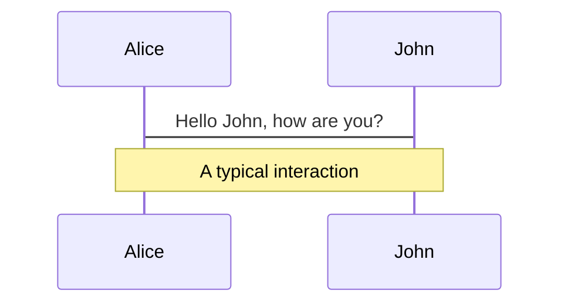
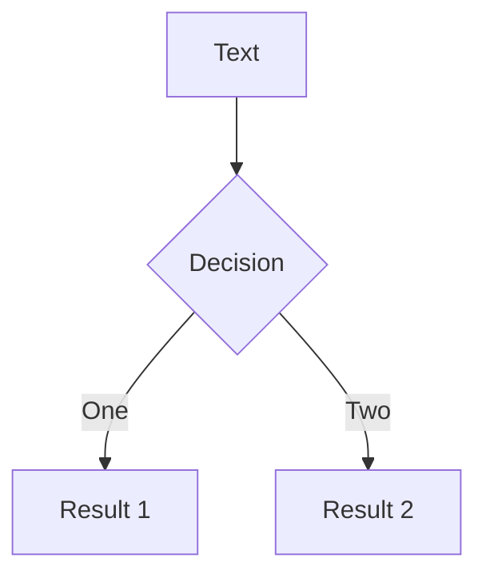
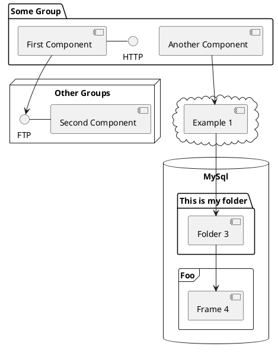

# アプリケーションエンジニアから見た<br>PostgreSQL15 の新機能

2022-10-01 OSC 2022 オンライン広島 <br>
日本 PostgreSQL ユーザー会 中国支部長 高橋 一騎

---

# 注意事項

- スライドは公開しています。
- 質問は **#osc22hi** に投稿してもらえれば、後ほど拾う事もできるかと思いますので是非活用してください。

---

# おしながき

- 自己紹介
- PostgreSQLとは
- PostgreSQL15の新機能
- まとめ

---

# 自己紹介

<div class="grid grid-cols-2 gap-4">
  <div>
    <ul>
      <li>高橋 一騎 (<a href="https://twitter.com/ikkitang">@ikkitang</a>)</li>
      <li>岡山在住</li>
      <li>スターフェスティバル株式会社<br>TechPdM 兼 アプリケーションエンジニア</li>
      <li>日本PostgreSQLユーザー会 中国地方支部長</li>
    </ul>
  </div>
  <div>
    
  </div>
</div>

---

# 自己紹介

- 日本PostgreSQLユーザー会中国地方支部長ではありますが、普段は普通にWebアプリケーションのコードを書いてていわゆるDBA的な仕事はしていません。
  - 割とPostgreSQLやMySQLはAWSのAmazon RDSでシュッと導入して使っています。
- 本セッションでは、今回のPostgreSQL15に入る機能をアプリケーションエンジニアとしての立場からピックアップをした上でご紹介をさせていただければと思います。

---
layout: center
class: text-center
---

# 2. PostgreSQLとは

---

# 2. PostgreSQLとは

<div class="grid grid-cols-2 gap-4">
  <div>
    <ul>
      <li>代表的なオープンソースのRDBMSの一つ</li>
      <li>もともと、大学の研究用に開発された研究用のRDBMSの <code>ingress</code> が元となっている。</li>
      <li>PostgreSQL開発コミュニティによって開発が行われていて、約1年弱の開発期間を経た後、毎年9~10月頃にメジャーバージョンがリリースされている。</li>
      <li>今年は<code>PostgreSQL15</code>のリリースに向けて開発が行われており、2022-10-06にGAの予定が発表された</li>
    </ul>
  </div>
  <div>
    <Tweet id="1571857779643777024" />
  </div>
</div>

---

# PostgreSQLの特徴

<div class="grid grid-cols-2 gap-10">
  <div>
    <h2>複数のIndexアルゴリズムを<br>サポート</h2>
    <ul>
      <li>B-Tree Index</li>
      <li>Hash Index</li>
      <li>GiST Index, SP-GiST index, GIN Index</li>
      <li>BRIN Index</li>
    </ul>
  </div>
  
  <div>
    <h2>豊富なデータ型をサポート</h2>
    <ul>
      <li>数値型, 文字型, boolean型, 列挙型</li>
      <li>UUID型</li>
      <li>JSON型</li>
      <li>配列型</li>
      <li>範囲型</li>
      <li>
        幾何データ型
        <ul>
          <li>座標点</li>
          <li>直線</li>
          <li>円</li>
        </ul>
      </li>
      <li>IPアドレス型</li>
    </ul>
  </div>
</div>

---

# PostgreSQLのバージョニング

- 10より前は `x.y.z` の `x.y`の部分がメジャーバージョン
  - 8.4 => 9.1 => 9.2 => 9.3 （年単位でバージョンアップ)
- 10移行は `x.y` の `x` の部分がメジャーバージョン
  - 10.0 => 11.0 => 12.0 (年単位でバージョンアップ)
  - EOLはリリースから5年間と定められているので今ではサポートされているのはすべて`x.y`の形式

<!--
10からx.y形式になった経緯を調べていたんですが、x.y形式にする事で毎年xの部分を上げる事が明確になるというメリットのためだそうです。
x.y.zの形式の頃はxの部分を上げる明確な基準がなくて各大きな機能開発のタイミングで上げてたという敬意があって、
毎年「今回はxを上げるか？」という議論がされてた、という話がありました。
-->

---
layout: center
---

# 今日はそんなPostgreSQL15の話

---
layout: center
---

# 3. PostgreSQL15の新機能

---

# 3. PostgreSQL15の新機能（抜粋）

- Merge文のサポート
- ロジカルレプリケーションの機能拡張
- パラレルクエリの強化
- バージョン非互換対応（新機能ではないけど）
  - PublicスキーマのCreate権限がデフォルトからなくなる

---

# Merge文のサポート

<div class="grid grid-cols-2 gap-4">
  <div>
    <ul>
      <li>INSERT・UPDATE・DELETEを一括で処理できる。</li>
      <li>SQL:2003で標準SQLとして定義されていて、OracleやSQL Serverではすでにサポートされている。</li>
      <li>
        条件に合致したとき（<code>WHEN MATCHED 句</code>）
        <ul>
          <li>UPDATE</li>
          <li>DELETE</li>
          <li>DO NOTHING: 何も処理しない</li>
        </ul>
      </li>
      <li>
        条件に合致しなかったとき<br>（<code>WHEN NOT MATCHED 句</code>）
        <ul>
          <li>INSERT</li>
          <li>DO NOTHING: 何も処理しない</li>
        </ul>
      </li>
    </ul>
  </div>
  <div>

例

```sql
MERGE INTO members

 USING (VALUES (1, 'test@example.com', 'test name')) 
   AS i(member_id, email, user_name)
   ON members.id = i.member_id

 WHEN MATCHED THEN
      UPDATE SET user_name = i.user_name
 WHEN NOT MATCHED THEN
      INSERT (member_id, email, user_name) 
      VALUES (i.member_id, i.email, i.user_name);
```

`WHEN MATCHED` 句では条件を複数記述できる

```sql
WHEN MATCHED AND hoge.flag = 1 THEN 
```

  </div>
</div>

---

# UPSERT文

- INSERT・UPDATEを組み合わせた操作を行う事からUPSERTと呼ばれる。
- PostgreSQLにはすでに`UPSERT`相当の機能がある
- 以下2つは成功時の結果が同じ

<br>

<div class="grid grid-cols-2 gap-4">
  <div>

MERGE文

```sql
MERGE INTO members
 USING (VALUES (1, 'test@example.com', 'test name')) 
   AS i(member_id, email, user_name)
   ON members.id = i.member_id
 WHEN MATCHED THEN
      UPDATE SET user_name = i.user_name
 WHEN NOT MATCHED THEN
      INSERT (member_id, email, user_name) 
      VALUES (i.member_id, i.email, i.user_name);
```

  </div>
  <div>

INSERT ON CONFLICT句

```sql
INSERT INTO members (member_id, email, user_name)
 VALUES (1, 'test@example.com', 'test name')
 ON CONFLICT(member_id)
 DO UPDATE SET user_name = 'test name';
```

  </div>
</div>

---

# UPSERT文の違い

<style>
table td, table th {
  border: 1px solid #FFF;
}
</style>

| 項目       | MERGE                                                                                        | INSERT ON CONFLICT                                           |
|----------|----------------------------------------------------------------------------------------------|--------------------------------------------------------------|
| 処理速度     | 簡易比較ではこちらの方が10~100%程高速                                                                       |                                                              |
| 実装方法     | targetとsourceをJOINし、MATCHED句に応じて処理 <br> JOINの結果で予め処理を決めてから実行するのでJOIN時と実データに差があればエラー出ることもある   | INSERTして、制約に違反したらUPDATEする <br> 処理をした結果に応じてUPDATEできるので並行性能が高い |
| 対応範囲     | DELETEに対応, 条件の比較に等号・不等号を扱える                                                                  | DELETE未対応, 条件の比較は等号により比較                                     |
| 実行の注意事項  |                                                                                              | ON CONFLICT に指定したカラムに必ずユニーク制約が必要                             |

<br>

- 処理速度は https://qiita.com/fujii_masao/items/462bac9f6a107d6134c4 を参考にしました

<!-- 
つまり、両者は完全に置き換え可能という間柄ではない
-->

---
layout: center
---

# ロジカル（論理）レプリケーションの機能拡張

---

# PostgreSQLのレプリケーションについておさらい

## ストリーミングレプリケーション

<br>

<div class="grid grid-cols-2 gap-4">
  <div>
    <ul>
      <li>データベースクラスタ全体を<br>WAL転送によってレプリケーションする</li>
      <li>レプリケーション元をプライマリ</li>
      <li>レプリケーション先をスタンバイ</li>
      <li>スタンバイは参照のみ</li>
      <li>主な利用用途は<br>リードレプリカ, フェイルオーバー</li>
    </ul>
  </div>
  <div>


  </div>
</div>

---

# PostgreSQLのレプリケーションについておさらい

## ロジカルレプリケーション

<br>

<div class="grid grid-cols-2 gap-4 h-4/5">
  <div>
    <ul>
      <li>テーブルやデータベース単位で<br>WALを操作の情報に変換した情報をレプリケーションする</li>
      <li>レプリケーション元をパブリッシャー</li>
      <li>レプリケーション元をサブスクライバーといい、Publicationを購読する仕組み</li>
      <li>サブスクライバーに書き込みをしても良い（完全同期の必要がない）</li>
      <li>OSやメジャーバージョンが異なってもレプリケーションできる</li>
      <li>主な利用用途は<br>分析目的のデータベースを作る, バージョンアップ</li>
    </ul>
  </div>
  <div class="flex flex-col place-content-around h-4/5">
    
    
  </div>
</div>

<!--
ロジカルレプリケーションの利用用途として、サブスクライバーは複数のパブリッシャーを持つ事もできるので、
複数のデータソースから特定のパブリッシャーにデータを集約して、分析用途として役立たせるような事も可能です。

また、メジャーバージョンが異なっていても、ロジカルレプリケーションであればレプリケーションできるので
旧バージョンをパブリッシャー、新しいバージョンのインスタンスをサブスクライバーとして定義しておく事で
安全にバージョンアップをすすめる事ができます
-->

---

# ロジカル（論理）レプリケーションの機能拡張

## 行フィルタ機能

- PUBLICATION定義にWHERE句を指定して条件を満たす行だけのPublisherが作成できるようになった

```sql
CREATE PUBLICATION chugoku_members
    FOR TABLE app.members WHERE address IN ('広島','岡山','島根','鳥取','山口');
```
<br>

## 列フィルタ機能

- PUBLICATION定義でカラムを絞る事で特定のカラムだけのPublisherが作成できるようになった

```sql
CREATE PUBLICATION member_emails
    FOR TABLE app.members (email);
```
<br>

## スキーマ対象でテーブルを一括指定

```sql
CREATE PUBLICATION app_schemas
    FOR ALL TABLES IN SCHEMA app;
```

<!--

行フィルタ機能は更新される事で条件を満たさなくなったら、サブスクリプション側では削除されます。
逆に更新された事で条件を満たすようになったら、サブスクリプション側では追加されます。

スキーマ対象のテーブル一括指定は
データベースにある全てのテーブルを対象とかはできたんですが、今回からスキーマに所属するテーブルを一括で指定できるようになりました

-->

---

# パラレルクエリーの性能向上

# Components

<div grid="~ cols-2 gap-4">
<div>

You can use Vue components directly inside your slides.

We have provided a few built-in components like `<Tweet/>` and `<Youtube/>` that you can use directly. And adding your custom components is also super easy.

```html
<Counter :count="10" />
```

<!-- ./components/Counter.vue -->
<Counter :count="10" m="t-4" />

Check out [the guides](https://sli.dev/builtin/components.html) for more.

</div>
<div>

```html
<Tweet id="1390115482657726468" />
```

<Tweet id="1390115482657726468" scale="0.65" />

</div>
</div>

---

## class: px-20

# Themes

Slidev comes with powerful theming support. Themes can provide styles, layouts, components, or even configurations for tools. Switching between themes by just **one edit** in your frontmatter:

<div grid="~ cols-2 gap-2" m="-t-2">

```yaml
---
theme: default
---
```

```yaml
---
theme: seriph
---
```


</div>

Read more about [How to use a theme](https://sli.dev/themes/use.html) and
check out the [Awesome Themes Gallery](https://sli.dev/themes/gallery.html).

---

## preload: false

# Animations

Animations are powered by [@vueuse/motion](https://motion.vueuse.org/).

```html
<div v-motion :initial="{ x: -80 }" :enter="{ x: 0 }">Slidev</div>
```

<div class="w-60 relative mt-6">
  <div class="relative w-40 h-40">
    
    
    
  </div>

  <div
    class="text-5xl absolute top-14 left-40 text-[#2B90B6] -z-1"
    v-motion
    :initial="{ x: -80, opacity: 0}"
    :enter="{ x: 0, opacity: 1, transition: { delay: 2000, duration: 1000 } }">
    Slidev
  </div>
</div>

<!-- vue script setup scripts can be directly used in markdown, and will only affects current page -->
<script setup lang="ts">
const final = {
  x: 0,
  y: 0,
  rotate: 0,
  scale: 1,
  transition: {
    type: 'spring',
    damping: 10,
    stiffness: 20,
    mass: 2
  }
}
</script>

<div
  v-motion
  :initial="{ x:35, y: 40, opacity: 0}"
  :enter="{ y: 0, opacity: 1, transition: { delay: 3500 } }">

[Learn More](https://sli.dev/guide/animations.html#motion)

</div>

---

# Diagrams

You can create diagrams / graphs from textual descriptions, directly in your Markdown.

<div class="grid grid-cols-3 gap-10 pt-4 -mb-6">







</div>

[Learn More](https://sli.dev/guide/syntax.html#diagrams)

---
layout: center
class: text-center
---

# Learn More

[Documentations](https://sli.dev) · [GitHub](https://github.com/slidevjs/slidev) · [Showcases](https://sli.dev/showcases.html)
